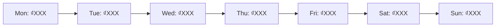

# Weekly Revenue Report Template

---

## Report Header

**Report Period:** [Start Date] - [End Date]
**Business Name:** [Your Business Name]
**Report Generated:** [Date & Time]
**Prepared By:** [Name/Role]

---

## Executive Summary

### Revenue Performance

| Metric | This Week | Last Week | Change | Target | % of Target |
|--------|-----------|-----------|--------|--------|-------------|
| **Total Revenue** | ₫[amount] | ₫[amount] | +X% | ₫[amount] | X% |
| **Net Revenue** | ₫[amount] | ₫[amount] | +X% | ₫[amount] | X% |
| **Order Count** | [number] | [number] | +X% | [number] | X% |
| **Average Order Value** | ₫[amount] | ₫[amount] | +X% | ₫[amount] | X% |

### Quick Insights
- **Best Day:** [Day] with ₫[amount] revenue
- **Top Product:** [Product Name] with ₫[amount] revenue
- **Top Channel:** [Channel Name] contributed X% of revenue
- **Status:** [On Track / Behind / Ahead] for monthly target

---

## Detailed Revenue Analysis

### Revenue Breakdown by Day

| Day | Revenue (VND) | Orders | AOV (VND) | Notes |
|-----|---------------|--------|-----------|-------|
| Monday | [amount] | [count] | [amount] | |
| Tuesday | [amount] | [count] | [amount] | |
| Wednesday | [amount] | [count] | [amount] | |
| Thursday | [amount] | [count] | [amount] | |
| Friday | [amount] | [count] | [amount] | |
| Saturday | [amount] | [count] | [amount] | |
| Sunday | [amount] | [count] | [amount] | |
| **TOTAL** | **[amount]** | **[count]** | **[amount]** | |

### Daily Trend Visualization

---

## Product Performance

### Revenue by Product

| Product Name | Revenue (VND) | Orders | AOV (VND) | % of Total Revenue | Change vs Last Week |
|--------------|---------------|--------|-----------|-------------------|---------------------|
| [Product 1] | [amount] | [count] | [amount] | X% | +/-X% |
| [Product 2] | [amount] | [count] | [amount] | X% | +/-X% |
| [Product 3] | [amount] | [count] | [amount] | X% | +/-X% |
| [Product 4] | [amount] | [count] | [amount] | X% | +/-X% |
| [Product 5] | [amount] | [count] | [amount] | X% | +/-X% |
| **TOTAL** | **[amount]** | **[count]** | **[avg]** | **100%** | |

### Top 5 Products by Revenue

1. **[Product Name]** - ₫[amount] ([X] orders)
2. **[Product Name]** - ₫[amount] ([X] orders)
3. **[Product Name]** - ₫[amount] ([X] orders)
4. **[Product Name]** - ₫[amount] ([X] orders)
5. **[Product Name]** - ₫[amount] ([X] orders)

---

## Channel Performance

### Revenue by Traffic Source

| Traffic Source | Revenue (VND) | Orders | AOV (VND) | % of Total | Conversion Rate |
|----------------|---------------|--------|-----------|------------|-----------------|
| Facebook Ads | [amount] | [count] | [amount] | X% | X% |
| Google Ads | [amount] | [count] | [amount] | X% | X% |
| Organic Search | [amount] | [count] | [amount] | X% | X% |
| Email Marketing | [amount] | [count] | [amount] | X% | X% |
| Direct | [amount] | [count] | [amount] | X% | X% |
| Referral | [amount] | [count] | [amount] | X% | X% |
| Other | [amount] | [count] | [amount] | X% | X% |
| **TOTAL** | **[amount]** | **[count]** | **[avg]** | **100%** | |

### Channel Distribution

---

## Key Metrics Comparison

### This Week vs Last Week vs Target

| Metric | This Week | Last Week | Change | Monthly Target | Weekly Target | On Track? |
|--------|-----------|-----------|--------|----------------|---------------|-----------|
| Total Revenue | ₫[amount] | ₫[amount] | +X% | ₫[amount] | ₫[amount] | ✓ / ✗ |
| Order Count | [number] | [number] | +X% | [number] | [number] | ✓ / ✗ |
| AOV | ₫[amount] | ₫[amount] | +X% | ₫[amount] | ₫[amount] | ✓ / ✗ |
| Conversion Rate | X% | X% | +X% | X% | X% | ✓ / ✗ |
| Refund Rate | X% | X% | +/-X% | <5% | <5% | ✓ / ✗ |
| Net Revenue | ₫[amount] | ₫[amount] | +X% | ₫[amount] | ₫[amount] | ✓ / ✗ |

### Month-to-Date Progress

| Metric | MTD Actual | Monthly Target | % Complete | Pace |
|--------|------------|----------------|------------|------|
| Revenue | ₫[amount] | ₫[amount] | X% | [Ahead/Behind/On Track] |
| Orders | [count] | [target] | X% | [Ahead/Behind/On Track] |

**Days Remaining in Month:** [X] days
**Projected Month-End Revenue:** ₫[amount] (based on current trend)

---

## Transaction Quality

### Refunds & Cancellations

| Metric | Count | Amount (VND) | Rate |
|--------|-------|--------------|------|
| Total Orders | [count] | ₫[amount] | - |
| Completed | [count] | ₫[amount] | X% |
| Refunded | [count] | ₫[amount] | X% |
| Cancelled | [count] | ₫[amount] | X% |
| Failed | [count] | - | X% |

**Refund Reasons (if tracked):**
- [Reason 1]: [count] cases
- [Reason 2]: [count] cases
- [Reason 3]: [count] cases

---

## Customer Insights

### Customer Segments (if data available)

| Segment | Orders | Revenue (VND) | AOV (VND) | Notes |
|---------|--------|---------------|-----------|-------|
| New Customers | [count] | ₫[amount] | ₫[amount] | |
| Returning Customers | [count] | ₫[amount] | ₫[amount] | |
| VIP/High-Value | [count] | ₫[amount] | ₫[amount] | |

### Notable Orders
- **Highest Order:** ₫[amount] - [Product] - [Source]
- **Most Products in Cart:** [X] items - ₫[amount]
- **First Purchase from New Channel:** [Details]

---

## Key Findings & Insights

### Positive Trends
1. **[Insight 1]**
   *Example: Facebook Ads revenue increased 35% week-over-week, driven by new creative set launched on Wednesday*

2. **[Insight 2]**
   *Example: Product X AOV jumped from ₫450K to ₫680K after adding premium bundle option*

3. **[Insight 3]**
   *Example: Weekend sales (Sat-Sun) contributed 45% of weekly revenue, up from 30% last week*

### Areas for Improvement
1. **[Concern 1]**
   *Example: Organic traffic orders declined 15%, investigate SEO ranking changes*

2. **[Concern 2]**
   *Example: Refund rate on Product Y at 8% (target <5%), review product quality/expectations*

3. **[Concern 3]**
   *Example: Monday-Tuesday revenue consistently low (₫200K total), consider mid-week promotions*

### Opportunities Identified
1. **[Opportunity 1]**
   *Example: 60% of Facebook Ad customers are first-time buyers, create email nurture sequence*

2. **[Opportunity 2]**
   *Example: Email campaign open rate high (32%) but CTR low (2%), test clearer CTAs*

---

## Action Items for Next Week

### Priority 1: Revenue Growth
- [ ] **Action:** [Specific task]
  **Owner:** [Name] | **Deadline:** [Date] | **Expected Impact:** [Metric improvement]

- [ ] **Action:** [Specific task]
  **Owner:** [Name] | **Deadline:** [Date] | **Expected Impact:** [Metric improvement]

### Priority 2: Optimization
- [ ] **Action:** [Specific task]
  **Owner:** [Name] | **Deadline:** [Date] | **Expected Impact:** [Metric improvement]

- [ ] **Action:** [Specific task]
  **Owner:** [Name] | **Deadline:** [Date] | **Expected Impact:** [Metric improvement]

### Priority 3: Investigation/Analysis
- [ ] **Action:** [Specific task]
  **Owner:** [Name] | **Deadline:** [Date] | **Expected Impact:** [Understanding gained]

---

## Monthly Projection

### Forecast Based on Current Trend

| Scenario | Projected Revenue | Basis | Confidence |
|----------|-------------------|-------|------------|
| **Conservative** | ₫[amount] | Current pace with -10% buffer | 70% |
| **Realistic** | ₫[amount] | Linear projection from MTD | 80% |
| **Optimistic** | ₫[amount] | Best week × 4 + planned campaigns | 50% |

### Key Assumptions
- No major external disruptions
- Current traffic sources remain stable
- [Add other assumptions]

### To Hit Monthly Target
- **Revenue Needed:** ₫[amount] remaining
- **Days Remaining:** [X] days
- **Required Daily Average:** ₫[amount]/day
- **vs. Current Average:** ₫[amount]/day (need +X% increase)

---

## Notes & Context

**External Factors This Week:**
- [Holiday/event that affected sales]
- [Competitor activity]
- [Platform changes]
- [Marketing campaign launches]

**Data Quality Notes:**
- [Any discrepancies or data issues]
- [Missing information]
- [Changes to tracking methodology]

**Next Report Date:** [Date]

---

## Appendix (Optional)

### Detailed Transaction List
[Link to full transaction export or attach CSV]

### Marketing Campaign Performance
[If running specific campaigns, detail results here]

### Customer Feedback Summary
[Notable reviews, complaints, testimonials]

---

**Report Version:** 1.0
**Template Last Updated:** February 2026
